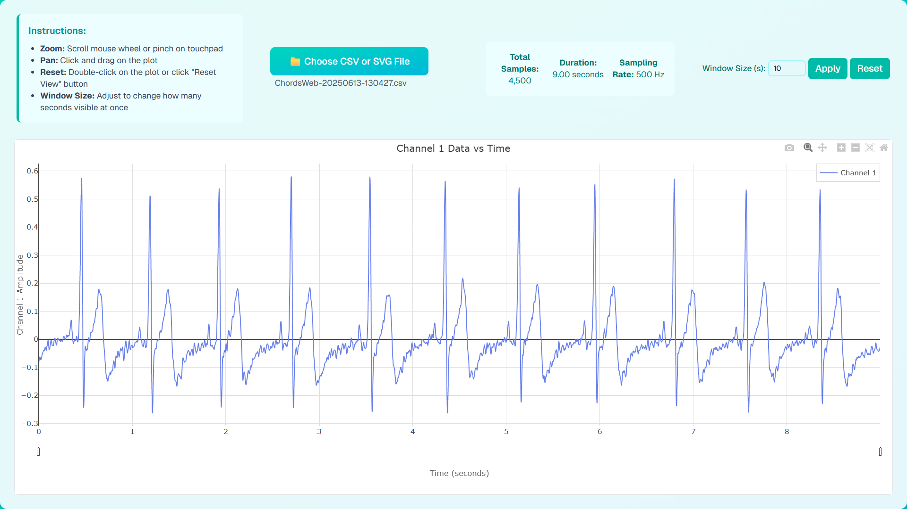
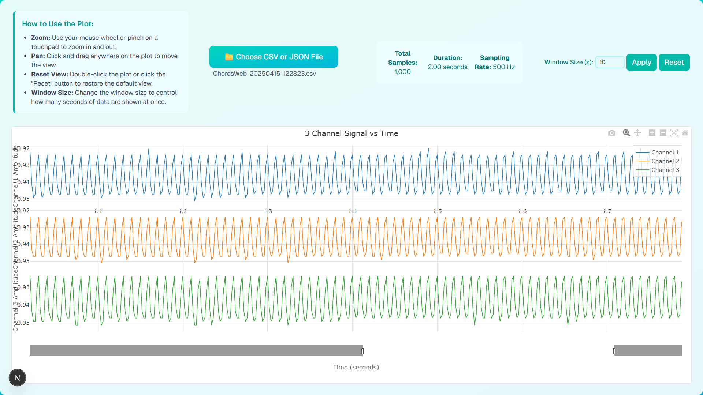

# Channel Data Plotter



Live Demo: [https://ritika8081.github.io/Plotter/](https://ritika8081.github.io/Plotter/)

A modern, interactive web application built with Next.js and TypeScript for visualizing channel data from CSV files. The app features a responsive UI, CSV upload, and dynamic plotting using Plotly.js.

## Features

- **CSV Upload:** Easily upload CSV files containing time-series channel data.
- **Interactive Plot:** Zoom, pan, and reset the plot using mouse or touch gestures.
- **Window Controls:** Adjust the visible time window for focused analysis.
- **Live Info:** Displays total samples, duration, and sampling rate.
- **Modern UI:** Clean, responsive design with a teal-cyan color scheme.

## Usage Instructions

1. **Upload CSV:** Click the "Choose CSV File" button and select your data file.
2. **View Plot:** The channel data will be plotted against time.
3. **Zoom & Pan:**
	- Zoom: Scroll mouse wheel or pinch on touchpad
	- Pan: Click and drag on the plot
	- Reset: Double-click the plot or use the "Reset" button
4. **Adjust Window:** Change the window size (in seconds) to control how much data is visible at once.

## Demo



## CSV Format
- The CSV should have at least two columns: the first is ignored (time is calculated by sample index), the second is the channel data.
0,0.12
1,0.15
2,0.10
...
```

## Tech Stack
- [Next.js](https://nextjs.org/) (App Router)
- [TypeScript](https://www.typescriptlang.org/)
- [Tailwind CSS](https://tailwindcss.com/)
- [Plotly.js](https://plotly.com/javascript/)
## Development

1. Install dependencies:
	```
	npm install
	```
2. Start the development server:
	```
	npm run dev
	```
3. Open [http://localhost:3000](http://localhost:3000) in your browser.
3. Open [http://localhost:3000](http://localhost:3000) in your browser.
